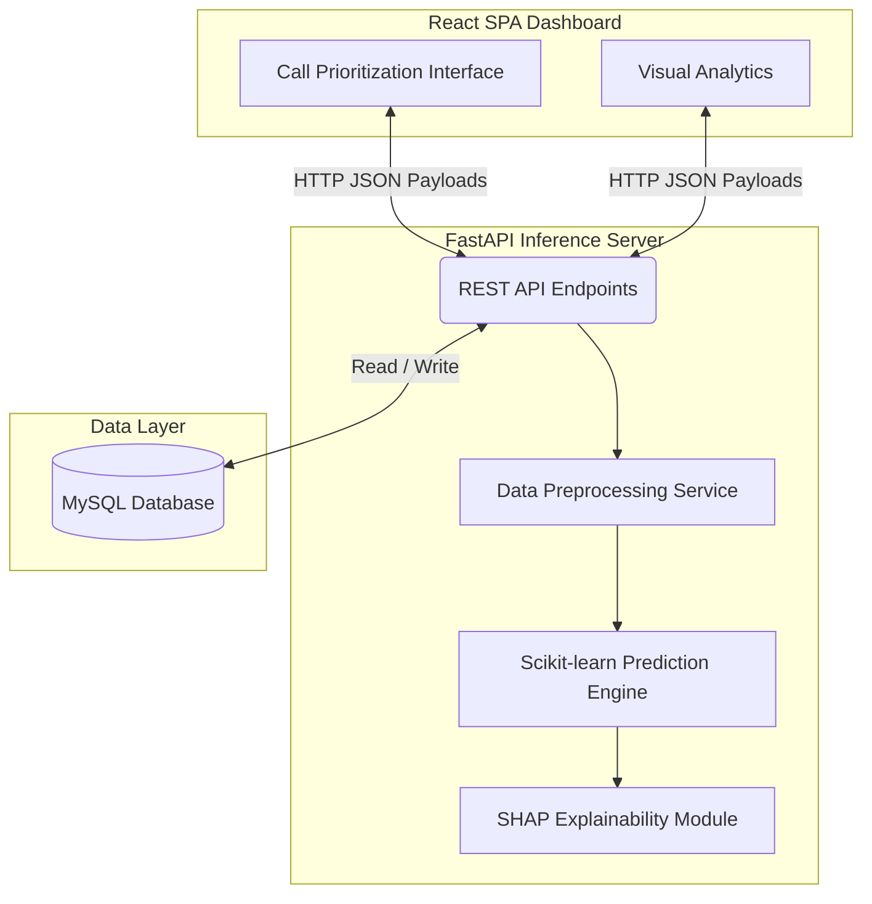

# 📞 ISP Customer Retention Command Center

[](https://github.com/0xAditya-Labs/ISP-Customer-retention-Recommender)

> **Beyond a Jupyter Notebook:** A production-ready, full-stack B2B SaaS application designed to help Internet Service Providers (ISPs) prioritize retention calls and reduce customer churn through Explainable AI.

## 🎯 The Problem vs. The Solution

**The Old Way (Blind Calling):** 
ISP support centers waste resources calling customers randomly, often offering expensive discounts to users who were never going to leave, while completely missing the users who are silently frustrated and about to cancel.

**The Solution (Smart Call-Routing):** 
This platform ingests customer data and acts as a Command Center for support agents. It ranks customers by churn risk. More importantly, it uses **SHAP Explainability** to tell the agent *exactly why* the customer is a flight risk (e.g., "High latency", "Contract ending"). The agent doesn't just know *who* to call, they know exactly *what to say and offer* to save them.

---

## ⚡ Technical Highlights & Unique Features

This project was built from scratch to demonstrate production-level engineering, bridging the gap between raw Data Science and deployable Software Engineering.

1. **Domain-Specific Feature Engineering:** Instead of just throwing raw data at a model, the backend pipeline engineers highly contextual business metrics on the fly:
   *   **Loyalty Index (`loyalty_index`):** Calculates a combined score of contract length and tenure to identify truly committed users.
   *   **CLV Proxy (`clv_proxy`):** Estimates Customer Lifetime Value dynamically to help agents prioritize saving high-value clients over low-margin accounts.
   *   **Flight Risk Flags:** Identifies "Early Tenure" users (high risk of immediate drop-off) and users with "No Support" features, allowing agents to offer targeted upsells (like discounted Tech Support) to stabilize the account.
2. **Productionized Machine Learning:** The ML models are entirely decoupled from their training notebooks. They are serialized, versioned, and served behind a highly concurrent **FastAPI** inference engine.
3. **Explainable AI (XAI) API:** Most ML projects treat models as black boxes. This backend calculates SHAP values on the fly and packages them into the REST payload, turning raw math into actionable business intelligence for the frontend.
4. **Decoupled Microservice Architecture:** Clean separation of concerns. A React client for the UI, a Python backend for heavy compute, and a MySQL instance for state and data persistence.
5. **Premium SaaS UI:** Built with Vite, React, and Tailwind CSS. The dashboard is designed to look and feel like an enterprise B2B product, not an academic dashboard.

## 🏗️ System Architecture



## 🚀 Tech Stack

*   **Frontend:** React, Vite, Tailwind CSS
*   **Backend Inference:** FastAPI, Python, Uvicorn
*   **Machine Learning:** Scikit-learn, Pandas, SHAP, Joblib
*   **Database:** MySQL

## 📂 Project Structure
```text
Code_Base/
├── Frontend/                 # React SPA (Vite + Tailwind)
│   ├── src/                  # Components, Hooks, API integration
│   └── package.json          # Node dependencies
│
├── backend/                  # Python FastAPI application
│   ├── api/                  # API routing and payload validation
│   ├── services/             # ML inference and data scaling logic
│   ├── models/               # Serialized models & expected features
│   └── requirements.txt      # Python dependencies
│
└── README.md                 # Project documentation
```

## ⚙️ Local Setup Instructions

### 1. Backend Setup
```bash
cd backend
pip install -r requirements.txt
uvicorn api.main:app --reload
```
*The API will be available at `http://localhost:8000`*

### 2. Frontend Setup
```bash
cd Frontend
npm install
npm run dev
```
*The application will run on `http://localhost:5173`*

## 🤝 Let's Connect
*   **GitHub:** [0xAditya-Labs](https://github.com/0xAditya-Labs)
*   **LinkedIn:** [Your LinkedIn URL] <!-- UPDATE THIS -->
*   **Portfolio:** [Your Portfolio URL] <!-- UPDATE THIS -->