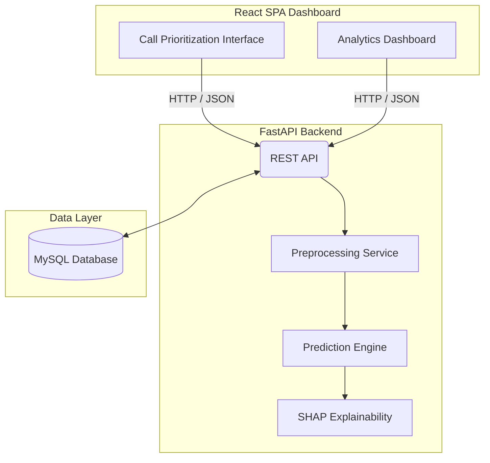

# 📞 ISP Customer Retention Command Center

> **A production-ready full-stack B2B SaaS platform that helps Internet Service Providers (ISPs) proactively reduce customer churn using Machine Learning and Explainable AI (XAI).**

Rather than relying on random retention calls, the platform intelligently prioritizes customers by churn risk and provides AI-generated explanations that help support agents take personalized retention actions.

---
# 🚀 Live Website :

> https://isp-customer-retention-recommender-chi.vercel.app/
---

# 🖥️ Platform Preview

> **Note:** Replace the image paths below with your actual GitHub image links.

## 1. Command Center Dashboard


## 2. Seamless Data Ingestion


## 3. Actionable Intelligence (Risk Ranking & SHAP Explanations)


---

# 🎯 Problem Statement

Traditional ISP retention teams often contact customers randomly or rely solely on historical experience.

This results in:

- Wasting time on customers who were never likely to churn.
- Missing genuinely at-risk customers before they leave.
- Offering generic discounts instead of solving the customer's actual pain points.
- Poor utilization of support teams and retention budgets.

---

# 💡 Solution

The **ISP Customer Retention Command Center** transforms churn prediction into an actionable decision-making platform.

The system:

- Ingests customer data through a simple CSV upload.
- Predicts churn probability using a trained Machine Learning model.
- Prioritizes customers based on churn risk.
- Generates SHAP Explainable AI insights for every prediction.
- Helps support agents understand **why** a customer is likely to leave.
- Enables personalized retention strategies instead of one-size-fits-all offers.

Instead of simply answering **"Who is likely to churn?"**, the platform also answers **"Why are they likely to churn?"**

---

# ✨ Key Features

## 📊 Intelligent Churn Prediction

- Predicts customer churn using Scikit-learn models.
- Real-time inference powered by FastAPI.
- Prioritizes customers based on churn probability.
- Enables smarter allocation of retention resources.

---

## 🧠 Explainable AI (SHAP)

Moving beyond black-box predictions, the platform generates SHAP explanations for every customer.

Support agents can instantly understand which factors contributed most to a customer's churn risk, such as:

- High network latency
- Contract nearing expiration
- Short customer tenure
- Low service engagement

This enables personalized conversations rather than generic retention offers.

---

## ⚙️ Domain-Specific Feature Engineering

The backend dynamically computes business-specific features before inference.

### Loyalty Index (`loyalty_index`)

Evaluates customer loyalty using:

- Contract duration
- Customer tenure

---

### Customer Lifetime Value Proxy (`clv_proxy`)

Estimates long-term customer value, helping prioritize high-value customers for retention.

---

### Flight Risk Indicators

Automatically flags customers with patterns such as:

- Early tenure
- Missing premium support features
- Low engagement

These indicators also assist in recommending targeted upselling opportunities.

---

## 🚀 Production-Ready Machine Learning

Unlike notebook-based ML projects, the inference pipeline is completely separated from model training.

Features include:

- Serialized Scikit-learn models
- Versioned model artifacts
- FastAPI inference service
- Concurrent request handling using Uvicorn
- Clean separation between training and deployment

---

## 🏢 Modern SaaS Dashboard

Built with React, Vite, and Tailwind CSS to deliver a polished enterprise experience.

Features include:

- Responsive dashboard
- CSV upload workflow
- Interactive analytics
- Risk ranking table
- SHAP explanation panels

---

# 🏗️ System Architecture



---

# 🚀 Tech Stack

### Frontend

- React
- Vite
- Tailwind CSS

### Backend

- FastAPI
- Python
- Uvicorn

### Machine Learning

- Scikit-learn
- Pandas
- NumPy
- SHAP
- Joblib

### Database

- MySQL

---

# 📂 Project Structure

```text
Code_Base/
│
├── Frontend/
│   ├── src/
│   ├── static/
│   │   ├── Landing page.png
│   │   ├── Output Table Contents.png
│   │   └── UI after submiting the csv.png
│   ├── package.json
│   └── ...
│
├── backend/
│   ├── api/
│   ├── services/
│   ├── models/
│   ├── requirements.txt
│   └── ...
│
└── README.md
```

---

# ⚙️ Local Setup

## 1️⃣ Backend

Environment variables used by the backend on Render:

```bash
ADMIN_USERNAME=admin
ADMIN_PASSWORD=admin123
DUMMY_TOKEN=dummy_jwt_token_for_now
CORS_ORIGINS=http://localhost:5173,http://127.0.0.1:5173
```

Render provides `PORT` automatically for the Web Service, so you do not hardcode it in the app.

Recommended Render backend start command:

```bash
uvicorn api.main:app --host 0.0.0.0 --port $PORT
```

```bash
cd backend

pip install -r requirements.txt

uvicorn api.main:app --reload
```

Backend runs on:

```
http://localhost:8000
```

---

## 2️⃣ Frontend

Environment variables used by the frontend on Vercel:

```bash
VITE_API_BASE_URL=https://your-render-backend.onrender.com
```

If you want the frontend to warm up the backend on visit, keep the app-level ping enabled in `src/App.jsx`.

### Env var checklist

Backend:

- `ADMIN_USERNAME` - backend login username
- `ADMIN_PASSWORD` - backend login password
- `DUMMY_TOKEN` - token returned by `/api/login` and checked by protected routes
- `CORS_ORIGINS` - comma-separated allowed frontend origins, for example `https://your-app.vercel.app,http://localhost:5173`

Frontend:

- `VITE_API_BASE_URL` - Render backend base URL used everywhere the frontend talks to the API

Suggested handling:

- Put local values in `.env` and commit only `.env.example`
- Set the same variables in Render and Vercel dashboards for production
- Update `VITE_API_BASE_URL` whenever the backend URL changes so every API call follows the same base path

```bash
cd Frontend

npm install

npm run dev
```

Frontend runs on:

```
http://localhost:5173
```

---

# 📈 Future Improvements

- User authentication and authorization
- Customer interaction history
- Email & SMS campaign integration
- Live prediction streaming
- Docker containerization
- Kubernetes deployment
- GitHub Actions CI/CD
- AWS / Azure deployment
- Model monitoring and drift detection

---

# 🤝 Connect

**GitHub:** https://github.com/0xAditya-Labs

**LinkedIn:** https://www.linkedin.com/in/aditya-chauhan-nitj
